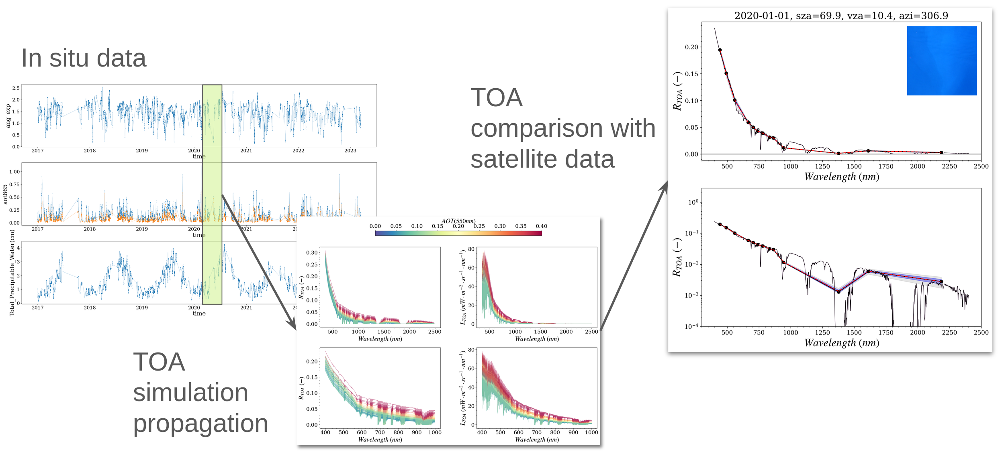

.. _methods:

Methods
=======

This page describes what :py:meth:`Process.execute <radcalnet_oc.process.Process.execute>` computes
to propagate the water-leaving signal measured at bottom-of-atmosphere (BOA) by AERONET-OC stations
up to the top-of-atmosphere (TOA) level, and the equations of the other modules of the package
(aerosol model retrieval, sunglint, spectral response of the sensors).

   Principle of the BOA-to-TOA propagation.

.. only:: html

   .. figure:: _static/slide_boa2toa_dark.png
      :width: 100%
      :figclass: only-dark
      :alt: Propagation of the water-leaving signal from bottom to top of atmosphere

      Principle of the BOA-to-TOA propagation.

Notation
--------

.. list-table::
   :header-rows: 1
   :widths: 20 60 20

   * - Symbol
     - Definition
     - Unit
   * - :math:`\lambda`
     - wavelength
     - nm
   * - :math:`\theta_0,\ \theta_v,\ \phi`
     - solar zenith, viewing zenith and relative azimuth angles
     - deg
   * - :math:`\mu_0 = \cos\theta_0,\ \mu_v = \cos\theta_v`
     - cosines of the solar and viewing zenith angles
     - --
   * - :math:`F_0(\lambda)`
     - extraterrestrial solar irradiance at mean Earth-Sun distance
     - mW m\ :sup:`-2` nm\ :sup:`-1`
   * - :math:`E_0(\lambda)`
     - plane solar irradiance at TOA
     - mW m\ :sup:`-2` nm\ :sup:`-1`
   * - :math:`E_d(\lambda)`
     - downwelling plane irradiance at BOA
     - mW m\ :sup:`-2` nm\ :sup:`-1`
   * - :math:`R_{rs}(\lambda)`
     - remote sensing reflectance
     - sr\ :sup:`-1`
   * - :math:`L_w(\lambda)`
     - water-leaving radiance
     - mW m\ :sup:`-2` sr\ :sup:`-1` nm\ :sup:`-1`
   * - :math:`\tau_a,\ \tau_r`
     - aerosol and Rayleigh optical thickness
     - --
   * - :math:`T_g^{\downarrow},\ T_g^{\uparrow}`
     - downward and upward gaseous transmittances
     - --
   * - :math:`T^{\downarrow},\ t^{\uparrow}`
     - downward (irradiance) and upward (radiance) atmospheric transmittances
     - --

Processing steps
----------------

For each measurement of the input time series (see :doc:`usage`),
:py:class:`~radcalnet_oc.process.Process` computes, at the full spectral resolution of the
gaseous absorption look-up table:

1. **Solar irradiance at TOA** :math:`E_0`, from the solar spectrum (TSIS-1 by default), the solar
   zenith angle and the day of year (`Solar irradiance`_).
2. **Gaseous transmittances** :math:`T_g^{\downarrow}` and :math:`T_g^{\uparrow}` along the Sun and
   viewing directions, from the surface pressure and the columns of water vapour, ozone and nitrogen
   dioxide (`Gaseous transmittance`_).
3. **Look-up table preparation.** The look-up tables of the aerosol models are combined with the
   ``aerosol_combination`` proportions and interpolated at the geometry of the simulation
   (:py:meth:`LUT.lut_preparation <radcalnet_oc.lut.LUT.lut_preparation>`, :ref:`methods-aerosol`).
4. **Atmospheric transmittances** :math:`T^{\downarrow}` and :math:`t^{\uparrow}`, interpolated for
   the aerosol optical thickness at 550 nm (`Atmospheric transmittances`_).
5. **Downwelling irradiance** :math:`E_d` and **water-leaving radiance** :math:`L_w = R_{rs}\,E_d` at
   the surface (`Downwelling irradiance at the surface`_).
6. **Atmospheric path reflectance** :math:`R_{atm}` (`Atmospheric path reflectance`_).
7. **TOA reflectance** :math:`R_{toa}`, Eq. :eq:`rtoa_rrs`.

The hyperspectral outputs are then convolved with the spectral response of the satellite sensor
(:ref:`spectral_convolution`). The sunglint reflectance of the direct sunlight can be computed
separately with :py:class:`~radcalnet_oc.coxmunk.Sunglint` (`Sunglint`_).

Top-of-atmosphere reflectance
-----------------------------

The TOA signal is expressed in reflectance units,

.. math::
   :label: rtoa_def

   R_{toa}(\lambda) = \frac{\pi\, L_{toa}(\lambda)}{E_0(\lambda)}.

It is decomposed into a water-leaving contribution, transmitted through the
atmosphere, and an atmospheric contribution that includes the light scattered by
molecules and aerosols and the skylight and sunlight reflected by the sea surface:

.. math::
   :label: rtoa

   R_{toa}(\lambda) = \frac{\pi\, t^{\uparrow}(\lambda)\, T_g^{\uparrow}(\lambda)\, L_w(\lambda)}{E_0(\lambda)}
   + T_g^{\downarrow}(\lambda)\, T_g^{\uparrow}(\lambda)\, R_{atm}(\lambda).

With :math:`L_w = R_{rs}\, E_d` and :math:`E_d = T^{\downarrow}\, T_g^{\downarrow}\, E_0`
(see :eq:`ed`), equation :eq:`rtoa` becomes

.. math::
   :label: rtoa_rrs

   R_{toa}(\lambda) = T_g^{\downarrow} T_g^{\uparrow}
   \left[ \pi\, R_{rs}(\lambda)\, T^{\downarrow}(\lambda)\, t^{\uparrow}(\lambda) + R_{atm}(\lambda) \right].

All terms are computed at the full spectral resolution of the gaseous absorption
look-up table (350--2500 nm) before being convolved with the spectral response of
the satellite sensor (see :ref:`spectral_convolution`).

Solar irradiance
----------------

The plane solar irradiance at TOA is

.. math::
   :label: e0

   E_0(\lambda) = \mu_0\, d^{2}(J)\, F_0(\lambda),

where :math:`F_0` is taken from one of the available solar spectra (TSIS-1 hybrid
reference spectrum by default, Thuillier, Gueymard or Kurucz), and
:math:`d^2(J) = (\bar{d}/d)^2` corrects for the Earth-Sun distance on day of year :math:`J`:

.. math::
   :label: earth_sun

   d^{2}(J) = {} & 1.00011 + 0.034221\cos\Theta + 0.00128\sin\Theta \\
   & + 0.000719\cos 2\Theta + 0.000077\sin 2\Theta,
   \qquad \Theta = \frac{2\pi J}{365}.

Downwelling irradiance at the surface
-------------------------------------

The downwelling plane irradiance just above the water surface is

.. math::
   :label: ed

   E_d(\lambda) = T^{\downarrow}(\lambda, \theta_0, \tau_a)\; T_g^{\downarrow}(\lambda)\; E_0(\lambda),

where :math:`T^{\downarrow}` is the total (direct + diffuse) irradiance transmittance of the
Rayleigh-aerosol atmosphere, interpolated from the transmittance look-up table for the
solar zenith angle and the aerosol optical thickness at 550 nm.

The photosynthetically available radiation is derived from :math:`E_d` as

.. math::
   :label: par

   \mathrm{PAR} = \frac{1}{N_A\, h\, c} \int_{400}^{700} \lambda\, E_d(\lambda)\, d\lambda,

with :math:`N_A` the Avogadro number, :math:`h` the Planck constant and :math:`c` the speed of light.

Gaseous transmittance
---------------------

Implemented in :py:class:`~radcalnet_oc.kernel.GaseousTransmittance`. Absorption by gases is treated separately from scattering. For a path of air mass
:math:`m = 1/\mu` (with :math:`\mu = \mu_0` downward and :math:`\mu = \mu_v` upward), the
transmittance of a gas :math:`g` with total column :math:`U_g` is

.. math::
   :label: tgas

   T_g(\lambda) = \exp\left[ -m\, c_g\, U_g\, \kappa_g(\lambda) \right],

where :math:`\kappa_g` is the normalized absorption optical thickness of the gas
(per unit column) from the gaseous look-up table and :math:`c_g` an optional scaling
coefficient (1 by default). The variable gases are :math:`H_2O`, :math:`O_3`, :math:`NO_2`
and :math:`CH_4`; their columns are provided by the input data (e.g., from CAMS).

The well-mixed background gases (:math:`CO`, :math:`CO_2`, :math:`O_2`, :math:`O_4`) are
scaled with the surface pressure :math:`P` relative to the reference pressure
:math:`P_{ref} = 1000` hPa:

.. math::
   :label: tgas_bg

   T_{bg}(\lambda) = \exp\left[ -m\, \frac{P}{P_{ref}}
   \left( \tau_{CO} + \tau_{CO_2} + \tau_{O_2} + \tau_{O_4} \right) \right].

The total gaseous transmittance is the product of all contributions,

.. math::
   :label: tgas_tot

   T_g = T_{bg} \prod_{g \in \{H_2O,\,O_3,\,NO_2,\,CH_4\}} T_g .

When only the altitude :math:`z` (in m) of a site is known, the pressure is estimated from
the sea-level pressure :math:`P_{sl}` with the barometric formula

.. math::
   :label: pressure

   P(z) = P_{sl} \left( 1 - \frac{0.0065\, z}{288.15} \right)^{5.255}.

Rayleigh and aerosol scattering
-------------------------------

.. _methods-aerosol:

Aerosol model mixture
~~~~~~~~~~~~~~~~~~~~~

The atmospheric terms are pre-computed for a set of OPAC aerosol models :math:`k`
(continental average, desert, maritime clean, urban, water-soluble, ...). A given
atmosphere is described by an external mixture of these models with proportions
:math:`f_k` (:math:`\sum_k f_k = 1`), and every look-up table quantity :math:`X`
(transmittances, path reflectance, optical thickness) is combined linearly:

.. math::
   :label: mixture

   X(\lambda, \tau_a) = \sum_k f_k\, X_k(\lambda, \tau_a).

The proportions can be retrieved from the AERONET spectral aerosol optical thickness with
:py:class:`~radcalnet_oc.kernel.Aerosol`. The
measured AOT is normalized by its value at the reference wavelength,
:math:`\tilde{\tau}_a(\lambda) = \tau_a(\lambda)/\tau_a(\lambda_{ref})`, and fitted with the
normalized AOT spectra :math:`\tilde{\tau}_k` of three models (desert, maritime clean and
water-soluble) by bounded least squares:

.. math::
   :label: aero_fit

   \hat{\mathbf{f}} = \underset{0 \le f_k \le 1}{\arg\min}\;
   \frac{1}{2}\sum_{i} \left[ \tilde{\tau}_a(\lambda_i)
   - \frac{\sum_k f_k\, \tilde{\tau}_k(\lambda_i)}{\sum_k f_k} \right]^2,

and the solution is normalized so that :math:`\sum_k \hat{f}_k = 1`.

Atmospheric transmittances
~~~~~~~~~~~~~~~~~~~~~~~~~~

The diffuse transmittances are interpolated from the transmittance look-up table for the
aerosol optical thickness at 550 nm, the wind speed and the geometry. The upward
radiance transmittance is approximated from the upward irradiance transmittance
:math:`T^{\uparrow}(\theta_v)` with an empirical exponent:

.. math::
   :label: tlu

   t^{\uparrow}(\lambda, \theta_v) = \left[ T^{\uparrow}(\lambda, \theta_v) \right]^{\gamma},
   \qquad \gamma = 1.07.

The direct (beam) transmittance along the Sun-surface-sensor path is given by the
Beer-Lambert law,

.. math::
   :label: tdir

   T_{dir}(\lambda) = T_g(\lambda)\, \exp\left[ -\left(\tau_r(\lambda) + \tau_a(\lambda)\right) m \right],
   \qquad m = \frac{1}{\mu_0} + \frac{1}{\mu_v},

where the Rayleigh optical thickness :math:`\tau_r` is taken from Bodhaine et al. (1999)
for :math:`P = 1013.25` hPa.

Atmospheric path reflectance
~~~~~~~~~~~~~~~~~~~~~~~~~~~~

The atmospheric reflectance :math:`R_{atm}` (intrinsic atmosphere + surface-reflected
skylight) is computed from the normalized radiance :math:`I` of the vector radiative transfer
look-up table, simulated for a rough sea surface:

.. math::
   :label: ratm

   R_{atm}(\lambda, \theta_0, \theta_v, \phi) = \frac{I(\lambda, \theta_0, \theta_v, \phi, \tau_a)}{\mu_0}.

The pure Rayleigh reflectance :math:`R_r` is obtained in the same way for :math:`\tau_a = 0`.

Sunglint
--------

Implemented in :py:class:`~radcalnet_oc.coxmunk.Sunglint`. The sunglint reflectance is modelled with the Cox and Munk (1954) wave slope statistics.
For a given geometry, the scattering angle :math:`\Theta` and the incidence angle
:math:`\omega` on the reflecting facets are

.. math::
   :label: scat_angle

   \cos\Theta = -\mu_0\mu_v - \sin\theta_0 \sin\theta_v \cos\phi,
   \qquad \omega = \frac{\pi - \Theta}{2},

and the tilt :math:`\theta_n` of the facets is given by

.. math::
   :label: tilt

   \cos\theta_n = \frac{\mu_0 + \mu_v}{2\cos\omega}.

The facet slopes, in the Sun frame and rotated into the wind frame
(wind direction :math:`\phi_w`), are

.. math::
   :label: slopes

   z_x = -\frac{\sin\theta_v\cos\phi + \sin\theta_0}{\mu_0 + \mu_v}, \quad
   z_y = -\frac{\sin\theta_v\sin\phi}{\mu_0 + \mu_v},

.. math::

   z_{up} = z_x\cos\phi_w + z_y\sin\phi_w, \quad
   z_{cr} = -z_x\sin\phi_w + z_y\cos\phi_w.

Slope distribution
~~~~~~~~~~~~~~~~~~

With an isotropic distribution, the slope variance depends on the wind speed :math:`W` (m s\ :sup:`-1`):

.. math::
   :label: cm_iso

   \sigma^2 = 0.003 + 5.12\times10^{-3}\, W, \qquad
   p(\theta_n) = \frac{1}{\pi\sigma^2}\exp\left( -\frac{\tan^2\theta_n}{\sigma^2} \right).

With the directional statistics, the upwind and crosswind variances are

.. math::
   :label: cm_dir

   \sigma_{cr}^2 = 0.003 + 1.92\times10^{-3}\, W, \qquad
   \sigma_{up}^2 = 3.16\times10^{-3}\, W,

and the distribution follows a Gram-Charlier expansion (convention of Munk, 2009), with
:math:`\xi = z_{up}/\sigma_{up}` and :math:`\eta = z_{cr}/\sigma_{cr}`:

.. math::
   :label: gram_charlier

   p(\xi, \eta) = \frac{e^{-(\xi^2+\eta^2)/2}}{2\pi\sigma_{up}\sigma_{cr}}
   & \Big[ 1 + \frac{c_{12}}{2}\,\xi(1-\eta^2) - \frac{c_{30}}{6}\,\xi(3-\xi^2)
   + \frac{c_{40}}{24}(3 - 6\xi^2 + \xi^4) \\
   & + \frac{c_{22}}{4}(1-\xi^2)(1-\eta^2)
   + \frac{c_{04}}{24}(3 - 6\eta^2 + \eta^4) \Big].

The skewness and peakedness coefficients depend on the selected statistics:

.. list-table::
   :header-rows: 1

   * - Statistics
     - :math:`\sigma_{cr}^2`
     - :math:`\sigma_{up}^2`
     - :math:`c_{12} = -c_{21}`
     - :math:`c_{30} = -c_{03}`
     - :math:`c_{40}`
     - :math:`c_{22}`
     - :math:`c_{04}`
   * - Cox & Munk (``cm_dir``)
     - :math:`0.003 + 1.92\cdot10^{-3}W`
     - :math:`3.16\cdot10^{-3}W`
     - :math:`-(0.01 - 8.6\cdot10^{-3}W)`
     - :math:`-(0.04 - 0.033\,W)`
     - 0.40
     - 0.12
     - 0.23
   * - Bréon & Henriot, 2006 (``bh2006``)
     - :math:`0.003 + 1.85\cdot10^{-3}W`
     - :math:`0.001 + 3.16\cdot10^{-3}W`
     - :math:`9\cdot10^{-4}W^2`
     - :math:`0.45/(1 + e^{7-W})`
     - 0.30
     - 0.12
     - 0.40

Fresnel reflection
~~~~~~~~~~~~~~~~~~

For a water refractive index :math:`n` (1.334 by default), the Fresnel amplitude coefficients
for the parallel and perpendicular polarizations are

.. math::
   :label: fresnel

   r_l = \frac{\sqrt{n^2 - \sin^2\omega} - n^2\cos\omega}{\sqrt{n^2 - \sin^2\omega} + n^2\cos\omega},
   \qquad
   r_r = \frac{\cos\omega - \sqrt{n^2 - \sin^2\omega}}{\cos\omega + \sqrt{n^2 - \sin^2\omega}},

which build the Mueller reflection matrix

.. math::
   :label: fresnel_matrix

   \mathbf{R}_F(\omega) = \frac{1}{2}
   \begin{pmatrix}
   r_l^2 + r_r^2 & r_l^2 - r_r^2 & 0 & 0 \\
   r_l^2 - r_r^2 & r_l^2 + r_r^2 & 0 & 0 \\
   0 & 0 & 2 r_l r_r & 0 \\
   0 & 0 & 0 & 2 r_l r_r
   \end{pmatrix}.

The matrix is rotated from the meridian planes of incidence and observation to the
reflection plane, :math:`\mathbf{R} = \mathbf{L}(\pi - \sigma_2)\, \mathbf{R}_F\, \mathbf{L}(-\sigma_1)`.

Shadowing and glint reflectance
~~~~~~~~~~~~~~~~~~~~~~~~~~~~~~~

Wave shadowing and hiding are accounted for with the Smith function (Ross & Dion, 2005, 2007):

.. math::
   :label: shadow

   \Lambda(\nu) = \frac{e^{-\nu^2} - \nu\sqrt{\pi}\,\mathrm{erfc}(\nu)}{2\nu\sqrt{\pi}},
   \qquad
   \nu = \frac{1}{\sqrt{2}\,\sigma\tan\theta},
   \qquad
   \sigma^2 = \sigma_{up}^2\cos^2\phi + \sigma_{cr}^2\sin^2\phi,

.. math::

   S = \frac{1}{1 + \Lambda(\nu_0) + \Lambda(\nu_v)}.

Finally, the Stokes vector of the sunglint reflectance is

.. math::
   :label: glint

   \begin{pmatrix} I_g \\ Q_g \\ U_g \\ V_g \end{pmatrix}
   = \frac{\pi\, S\, p(z_{up}, z_{cr})}{4\,\mu_0\,\mu_v\,\cos^4\theta_n}\;
   \mathbf{R}\begin{pmatrix} 1 \\ 0 \\ 0 \\ 0 \end{pmatrix}.

.. _spectral_convolution:

Spectral convolution
--------------------

Implemented in :py:class:`~radcalnet_oc.lut.Spectral` (``convolve`` for Gaussian and ``convolve2``
for super-Gaussian responses). The hyperspectral quantities :math:`X(\lambda)` are integrated over the spectral response
function :math:`S_b` of each band :math:`b` of the satellite sensor:

.. math::
   :label: convolution

   X_b = \frac{\int X(\lambda)\, S_b(\lambda)\, d\lambda}{\int S_b(\lambda)\, d\lambda}.

When the actual spectral responses are not available, they are modelled from the central
wavelength :math:`\lambda_b` and the full width at half maximum :math:`\Gamma_b` with a
super-Gaussian function of exponent :math:`p`:

.. math::
   :label: super_gaussian

   S_b(\lambda) = \frac{1}{\sqrt{2\pi}\,\sigma_b}
   \exp\left( -\frac{|\lambda - \lambda_b|^{p}}{2\,\sigma_b^{p}} \right),
   \qquad
   \sigma_b = \frac{\Gamma_b}{2}\left( 2\ln 2 \right)^{-1/p}.

The Gaussian case corresponds to :math:`p = 2`, i.e. :math:`\sigma_b = \Gamma_b / (2\sqrt{2\ln 2})`.

References
----------

- Bodhaine, B. A., Wood, N. B., Dutton, E. G., & Slusser, J. R. (1999). On Rayleigh optical
  depth calculations. *J. Atmos. Ocean. Tech.*, 16, 1854--1861.
- Bréon, F.-M., & Henriot, N. (2006). Spaceborne observations of ocean glint reflectance and
  modeling of wave slope distributions. *J. Geophys. Res.*, 111, C06005.
- Coddington, O. M., et al. (2021). The TSIS-1 Hybrid Solar Reference Spectrum.
  *Geophys. Res. Lett.*, 48(12), e2020GL091709.
- Cox, C., & Munk, W. (1954). Measurement of the roughness of the sea surface from photographs
  of the sun's glitter. *J. Opt. Soc. Am.*, 44(11), 838--850.
- Munk, W. (2009). An inconvenient sea truth: spread, steepness, and skewness of surface slopes.
  *Annu. Rev. Mar. Sci.*, 1, 377--415.
- Ross, V., & Dion, D. (2007). Sea surface slope statistics derived from Sun glint radiance
  measurements and their apparent dependence on sensor elevation. *J. Geophys. Res.*, 112, C09015.
